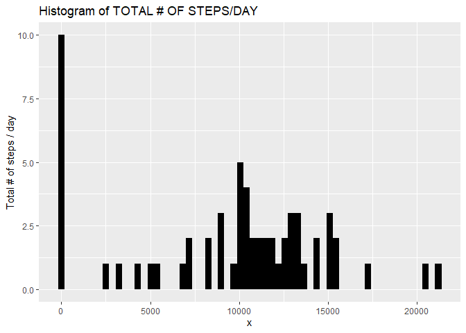
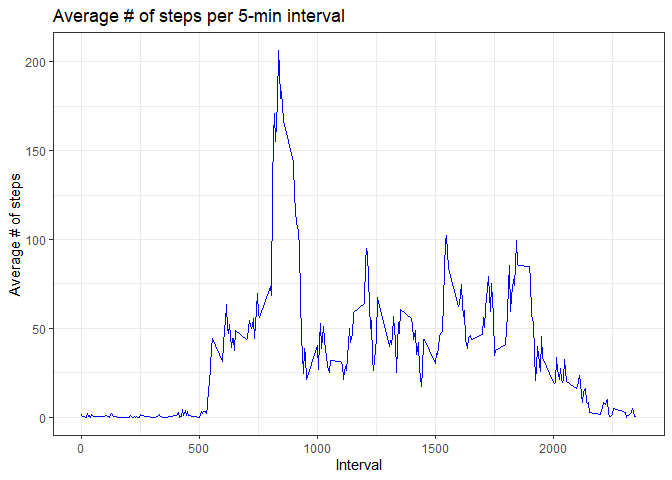
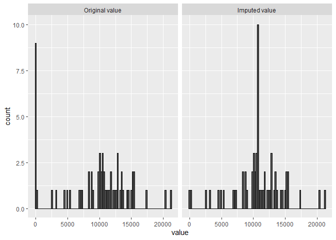
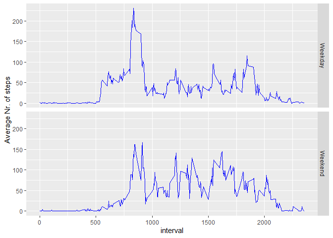

## Loading and preprocessing the data


```r
unzip(zipfile = "./activity.zip")
activity_dataset <- read.csv("activity.csv", sep =",")
library(tidyverse)
```

```
## -- Attaching packages ------------------------------------------------------------ tidyverse 1.2.1 --
```

```
## v ggplot2 3.2.1     v purrr   0.3.2
## v tibble  2.1.3     v dplyr   0.8.3
## v tidyr   0.8.3     v stringr 1.4.0
## v readr   1.3.1     v forcats 0.4.0
```

```
## -- Conflicts --------------------------------------------------------------- tidyverse_conflicts() --
## x dplyr::filter() masks stats::filter()
## x dplyr::lag()    masks stats::lag()
```

```r
library(lubridate)
```

```
## 
## Attaching package: 'lubridate'
```

```
## The following object is masked from 'package:base':
## 
##     date
```

```r
library(reshape2)
```

```
## 
## Attaching package: 'reshape2'
```

```
## The following object is masked from 'package:tidyr':
## 
##     smiths
```


## What is mean total number of steps taken per day?


```r
total_steps_day <- aggregate(activity_dataset$steps, by=list(Date=activity_dataset$date), na.rm=TRUE, FUN=sum)
mean_steps_day <- mean(total_steps_day$x, na.rm = TRUE)
median_steps_day <- median(total_steps_day$x, na.rm = TRUE)
print(c("Means Nr. of steps/day = ", round(mean_steps_day)))
```

```
## [1] "Means Nr. of steps/day = " "9354"
```

```r
print(c("Median Nr. of steps/day = ", round(median_steps_day)))
```

```
## [1] "Median Nr. of steps/day = " "10395"
```


And here is a histogram of the distribution of the Total Nr. of steps/day:


```r
## Plot histogram of Total # of steps/day
totaldayplot <- ggplot(total_steps_day, aes(x=x))
totaldayplot + geom_histogram(fill = "black", bins = 60) + ylab("Total # of steps / day") + ggtitle("Histogram of TOTAL # OF STEPS/DAY")
```

<!-- -->


## What is the average daily activity pattern?


```r
## calculate mean # steps per interval
mean_steps_interval <- aggregate(activity_dataset$steps, by=list(Interval=activity_dataset$interval), na.rm=TRUE, FUN=mean)

## make plot
avg_daypatt_plot <- ggplot(data=mean_steps_interval, aes(Interval, x))
avg_daypatt_plot + geom_line(color="blue") + ylab("Average # of steps") + theme_bw() + ggtitle("Average # of steps per 5-min interval")
```

<!-- -->

```r
## which interval has the highest mean # of steps
print(c("The interval which has the highest AVERAGE of step is", mean_steps_interval[which.max(mean_steps_interval$x), 1]))
```

```
## [1] "The interval which has the highest AVERAGE of step is"
## [2] "835"
```


## Imputing missing values


```r
missing <- sum(is.na(activity_dataset))

###  the number of missing values is:  """"""""
print (c("The number of missing values in the dataset is", missing))
```

```
## [1] "The number of missing values in the dataset is"
## [2] "2304"
```


Missing data will be replaced with mean of the 5-min interval to which the NA value falls into.

First we create new Dataset based off the original dataset, so that we can transform it:


```r
imputed_dset <- activity_dataset
x <- length(imputed_dset$steps)
```


And then we generate the imputations:


```r
for (i in 1:x)  
{
    
    if (is.na(imputed_dset[i,1])) 
    { 
        z <- imputed_dset[i, 3]
        where_is_the_interval <- which(mean_steps_interval$Interval == z)
        imputed_dset[i, 1] <- mean_steps_interval[where_is_the_interval, 2]
    }
    
    
}


imputed_total_steps_day <- aggregate(imputed_dset$steps, by=list(Date=imputed_dset$date), na.rm=TRUE, FUN=sum)
```


We want to plot the 2 histograms side by side  -- so need to merge the 2 datasets, and then MELT them via variable "Original/Imputed value":


```r
combined <- cbind(total_steps_day, imputed_total_steps_day$x)
colnames(combined) <- c("Date","Original value", "Imputed value")

## Now melt
melted_for_steps <- melt(combined, id=c("Date"), measure.vars = c("Original value", "Imputed value"))

## Plot histogram
histocombined <- ggplot(melted_for_steps,aes(value)) + geom_histogram(binwidth = 1) + facet_wrap(~variable)
histocombined + geom_histogram(bins = 100, colour = "black")
```

<!-- -->

```r
## Calculate mean & median of Dataset with imputed values
mean_steps_day_imputed <- mean(combined$`Imputed value`, na.rm = TRUE)
median_steps_day_imputed <- median(combined$`Imputed value`, na.rm = TRUE)

######### Print this finding #############
print("AFTER having performed imputation of missing data, the new values for the Mean and Median are:")
```

```
## [1] "AFTER having performed imputation of missing data, the new values for the Mean and Median are:"
```

```r
print(c("Means Nr. of steps/day = ", round(mean_steps_day_imputed)))
```

```
## [1] "Means Nr. of steps/day = " "10766"
```

```r
print(c("Median Nr. of steps/day = ", round(median_steps_day_imputed)))
```

```
## [1] "Median Nr. of steps/day = " "10766"
```


## Are there differences in activity patterns between weekdays and weekends?

First Find out which date was weekday and which was weekend (in the dataset with the imputed data):


```r
imputed_dset$date <- as.Date(imputed_dset$date, format="%Y-%m-%d")
weekday <- weekdays(imputed_dset$date)
imputed_dset <- cbind(imputed_dset,weekday)
```


Then we create a factor variable that differentiates weekdays and weekend, and calculate the AVERAGE total Nr. steps taken (in 5 mins intervals) in weekdays and weekends:


```r
imputed_dset$findeono <- sapply(imputed_dset$date, function(x) {
    if (weekdays(x) == "sábado" | weekdays(x) =="domingo") 
    {y <- "Weekend"} else 
    {y <- "Weekday"}
    y
})

imputed_dset$findeono <- as.factor(imputed_dset$findeono)

## Calculate AVERAGE total Nr. steps taken (in 5 mins intervals) in weekdays and weekends
Mean_by_weektime <- imputed_dset %>% group_by(findeono, interval) %>% summarise(mean_by_interval = mean(steps))
```


Finally, we plot this AVERAGE in 2 separate plots (one for the weekday period, another for the weekend):


```r
plot_weekdays_vs_ends <- ggplot(Mean_by_weektime, aes(interval, mean_by_interval)) 
plot_weekdays_vs_ends + geom_line(colour = "blue") + facet_grid(findeono ~ .) + ylab("Average Nr. of steps")
```

<!-- -->
